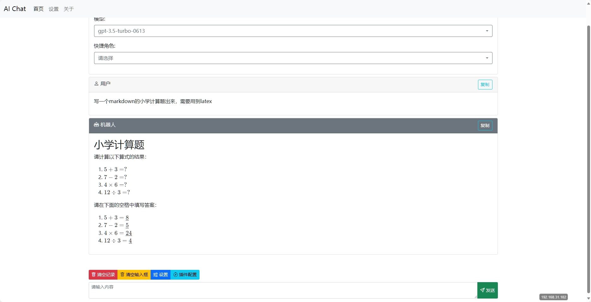

# chatgpt-web-demo
使用php，vue2,bootstarp5构建简单的chatgpt对话页面
练手项目
支持自定义地址和key
支持markdown，latex公式实时渲染
支持stream流式输出
php流式输出参考[项目](https://github.com/qiayue/php-openai-gpt-stream-chat-api-webui "项目")

## 图片展示

